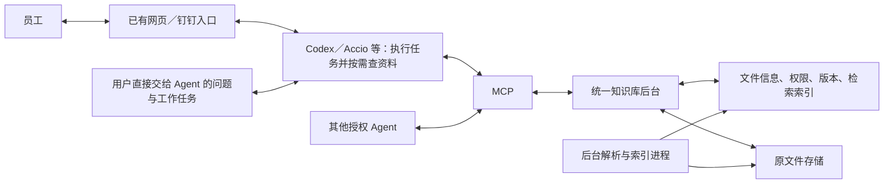

# 企业知识库项目设计基线

更新日期：2026-09-15。本文整合交接文档及本任务中已确认的需求，作为开发计划的项目依据。步骤 0–5 已完成开发与本机合成验证，步骤 6–8 正在实施；实际组件和验证边界见开发计划及 validation 报告，不代表正式上线或业务验收完成。

## 1. 目标与原则

建设一套公司服务器上的统一企业文件与知识库，服务以下两类需求：

1. Codex、Accio 等 AI／Agent 的额外企业知识扩展包：让 Agent 在回答问题和执行各种工作任务时，能够了解公司的组织业务、产品、工作规范、表达要求和历史经验，并据此形成贴合公司的判断、回答和交付物。Agent 通过 MCP 按需获取和应用这些知识，任务理解、判断、计算及交付由原 Agent 完成。
2. 员工的资料使用：经已有网页／钉钉入口上传文件、查找资料、询问内容、获取完整文件。

简单、高效、合理设计，不过分设计。先完成实际闭环，再根据问题优化。考虑 token 消耗，采用相关片段和按需读取，不设置严格固定的任务 token 配额。

通用工作过程：Agent 接到问题或任务 → 识别需要了解的公司背景、事实、规范或经验 → 通过 MCP 获取相关知识 → 理解其适用范围并应用到回答、判断和执行步骤 → 继续完成符合公司需求的结果。这种能力贯穿各种工作场景，历史报价仅是说明性例子，不作为产品定位或专门主流程。

用户所说“调教 AI”，在本项目中落实为提供企业知识和工作要求，使 Agent 的行为和产出更贴合公司；首版通过外部知识与适配约定实现，不以模型训练为前提。目标是让 Agent 像了解公司的员工一样利用企业知识工作，实际了解程度以已入库知识及任务验证结果为依据，不承诺连接后自动掌握全部资料。

“企业知识扩展包”由统一资料库、MCP 能力和简短的使用约定构成；包装形式按客户端支持情况确定，不预设必须开发某种专有插件。使用约定让 Agent 在需要公司背景、事实、规范或经验时主动查阅，并将取得的知识用于当前任务；不依赖员工每次明确说“搜索知识库”。相关企业上下文按需获取，不要求每次重复加载或扫描全库，也不假设只连接 MCP 就自动知道何时查询。

## 2. 已确定架构

入口与 Agent 的衔接由用户说明已实现，尚未检查实现或验证运行。入口、Agent 与服务器的位置不作相同假设。

首版一个后台应用、一个独立后台处理进程起步；MCP 是同一后台的接入方式。模型回答与任务执行由现有 Agent 负责。后台解析、OCR、向量化和索引是固定任务，不设置专用入库 Agent。

## 3. 功能范围

| 范围 | 首版要求 |
|---|---|
| 文件管理 | 原文件先保存、可查询状态、按权获取文件、分类和关联信息 |
| 内容检索 | 关键词与向量混合检索；按组织、型号、产品、文件、版本和权限过滤 |
| 读取 | 相关段落、章节、表格和来源位置；按需获取更多内容 |
| 企业知识扩展 | 按需理解公司背景、查阅事实、应用规范与模板、参考历史经验，使回答与任务结果符合公司需求 |
| 发布与版本 | 自由提交、授权发布；本地编辑后提交替换稿；冲突检查；历史可追溯 |
| 撤下与恢复 | 停止正式检索和普通下载，保留授权历史追溯及恢复能力 |
| 基础运行 | 处理失败可重试、服务恢复、日志、独立备份与恢复验证 |
| Agent 适配 | 可信身份、文件交接、MCP 兼容、结果返回及简短使用约定 |

复用现有网页、钉钉和 Agent，不另建聊天应用或完整员工网站。不开发协同编辑、区块链、全终端同步、知识图谱、自动多层摘要、模型微调或集群调度系统。

## 4. 分类

以[知识库分类方案](知识库分类方案.md)为分类配置依据。8 个分区：通用国际集团、百斯特事业部、星源事业部、百创事业部、爱吉克事业部、吉姆克事业部、商情管理中心、公司公共知识。

6 个用途分类：组织与业务背景、产品与技术资料、项目与客户资料、流程规范与模板、经验案例与常见问题、其他资料。

保持组织与用途两级，产品／项目／型号／格式作为筛选项。跨部门共享使用同一份文件记录及版本，不复制多个知识库。部门名称不等于访问权限，“公共知识”也需授权。

## 5. 数据与处理原则

- 原文件是依据，解析结果和索引可重建。文件先保存，后台再解析和向量化。
- 处理状态与发布状态分开；上传成功、处理完成、正式可检索不能混为一谈。
- 解析或向量化失败不丢文件；系统明确标明可检索、可读取的范围。
- PDF、Word、Excel、PPT 的常规文字和表格优先验证；CAD／3D 先保存完整文件或模型包并关联辅助资料，不宣称能够验证几何信息。
- 引用绑定具体版本与来源位置。没有可靠页码时使用章节／表格等真实位置，不编造页码。
- 历史业务记录和同一文件的旧版本分开处理：不同时间、项目的记录可各自作为正式历史资料参与检索；同一记录被修订时才使用该文件的版本规则。不得只按上传时间或“最新”排序排除相关历史经验。
- 返回知识时保留日期、适用产品／业务、前提及限制等原文条件。区分当前规范、事实依据和历史参考；已发布的历史案例不自动成为当前执行要求。具体场景信息沿用原文及通用关联字段，不为例子增加专用业务数据库。
- 替换或撤下影响普通检索、读取和文件交付；提交旧稿须防止覆盖新版本。
- 业务负责人负责内容发布，IT 负责运行维护，不因运维角色自动获得业务发布权。
- 员工或服务身份来自认证链路，后台不能相信模型填写的姓名、部门或角色。
- 云端模型可能接收检索内容；本地存储不代表全部数据不出内网。接入时明确允许的数据流，首轮组件试验默认使用本地模型及合成资料。

## 6. 效率

文件提前解析索引；明确文件或编号时直接定位；搜索返回少量相关片段及来源，需要时展开。元数据筛选、排序和去重由后台完成。

验证“Agent 在问题回答及工作任务中主动获取和应用企业知识”：既检查是否找到依据，也检查公司背景、规范、术语及经验是否实际改善了判断和交付物。实际能力由 MCP 和简短使用约定共同提供，业务流程继续由原 Agent 执行。

先不引入额外回答缓存、独立重排模型或精细 token 预算。观察真实任务的依据准确性、累计 token、工具调用和耗时后再决定优化。模型输入中的历史重复消耗由现有 Agent 配合控制，不对 MCP 的能力作扩大承诺。

## 7. 容量与验收

首期支持 20–50 个 Agent 同时读取，按 50 验证；中后期扩展并验收到 200。首期基线以每个 Agent 同一时刻一个搜索或读取请求计，真实调用行为在对接后修正。

浏览器／钉钉背后 Agent 的检索计入同一总负载。查询耗时与模型生成耗时分别记录，大文件传输单测。50／200 是目标，尚未测试，不是容量承诺。

业务核心验收从公司实际工作中选择覆盖“背景理解、事实查询、规范应用、经验参考”的少量代表性问题和任务，检查 Codex／Accio 是否主动获取适当知识、理解适用条件，并让回答、执行步骤和交付物符合公司要求；同时观察调用量和 token 消耗。具体案例可替换，历史报价只是其中一种可能。员工文件使用能力另行验收。

技术验收覆盖真实文件、新鲜导入、权限隔离、正式版本、撤下、冲突、解析失败重试、批量导入与查询并行、断线重启及独立恢复。硬件、QPS、响应时间与可用性阈值在首阶段基于实际条件形成验收配置，不能用任意机器上的空库测试替代。

## 8. 开发前输入及处理方式

用户已确认服务器系统为 Windows，配置够用；主要客户端为 Codex 和 Accio。Windows 具体版本、CPU／内存／磁盘／GPU、客户端具体版本与认证方式、真实文件样本和资料规模在实施阶段记录。当前开发电脑不自动视为目标服务器。

首版按 Windows 原生后台服务设计，不默认安装 Docker Desktop、WSL 或更换操作系统。上述缺项不阻止编写开发计划及合成样本验证，但阻止作出真实服务器兼容、真实业务质量、真实身份联通或 50／200 容量已达标的结论。技术验证和真实接入分别设交付证据。

## 9. 来源

- 原始项目交接材料：由项目负责人线下保管，本仓库以当前设计和开发计划为准。
- 本任务中后续用户确认：简洁优先；后台负责解析和向量化；按截图确定组织分类；编制开发计划。
- 原始交接文档保留作历史来源。本项目后续更新直接整合覆盖本基线及相关计划，不追加互相矛盾的结论。
